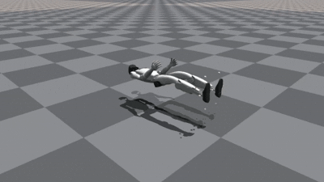
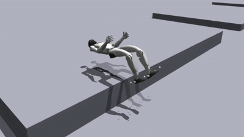
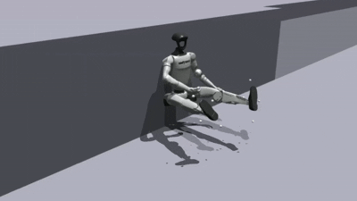
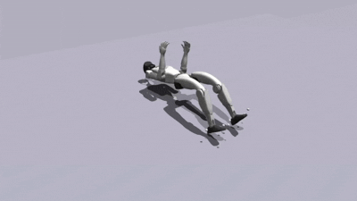
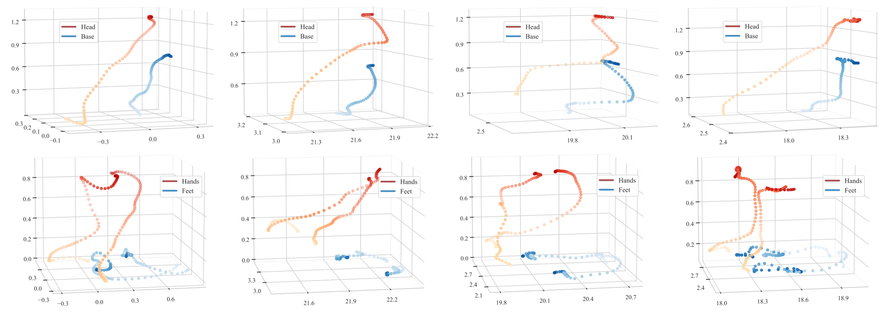

# Humanoid Standing-up Control
## 🛠️ Installation Instructions
Clone this repository:
```bash
git clone https://github.com/OpenRobotLab/HoST.git
cd HoST
```
Create a conda environment:
```bash
conda env create -f conda_env.yml 
conda activate host
```
Install pytorch 1.10 with cuda-11.3:
```bash
pip3 install torch==1.10.0+cu113 torchvision==0.11.1+cu113 torchaudio==0.10.0+cu113 -f https://download.pytorch.org/whl/cu113/torch_stable.html
```

Download and install [Isaac Gym](https://developer.nvidia.com/isaac-gym):
```bash
cd isaacgym/python && pip install -e .
```
Install rsl_rl (PPO implementation) and legged gym:
```bash
cd rsl_rl && pip install -e . && cd .. 
cd legged_gym &&  pip install -e . && cd .. 
```

## 🤖 Run HoST on Unitree G1
### Overview of Main Simulation Motions
<table style="width: 100%; border-collapse: collapse; margin: -5px -0px -12px 0px;">
    <tr>
        <td align="center" style="width: 24%; padding: 2px;">
            <br/>
            <span style="font-size: 0.9em;">Ground</span>
        </td>
        <td align="center" style="width: 24%; padding: 2px;">
            <br/>
            <span style="font-size: 0.9em;">Platform</span>
        </td>
        <td align="center" style="width: 24%; padding: 2px;">
            <br/>
            <span style="font-size: 0.9em;">Wall</span>
        </td>
        <td align="center" style="width: 24%; padding: 2px;">
            <br/>
            <span style="font-size: 0.9em;">Slope</span>
        </td>
    </tr>
</table>

### Policy Training
Train standing-up policies over different terrains:
```bash
python legged_gym/scripts/train.py --task g1_${terrain} --run_name test_g1 # [ground, platform, slope, wall]
```

After training, you may play the resulted checkpoints:
```bash
python legged_gym/scripts/play.py --task g1_${terrain} --checkpoint_path ${/path/to/ckpt.pt} # [ground, platform, slope, wall]
```

### Policy Evaluation
We also provide the evaluation scripts to record success rate, feet movement distance, motion smoothness, and consumed energy:
```bash
python legged_gym/scripts/eval/eval_${terrain}.py --task g1_${terrain} --checkpoint_path ${/path/to/ckpt.pt} # [ground, platform, slope, wall]
```
Domain randomization is applied during the evaluation to make the results more generalizable. 

### Motion Visualization
<p align="left">
  
</p>


First, run the following command to collect produced motion:
```bash
python legged_gym/scripts/visualization/motion_collection.py --task g1_${terrain} --checkpoint_path ${/path/to/ckpt.pt} # [ground, platform, slope, wall]
```

Second, plot the 3D trajectories of motion keyframes:
```bash
python legged_gym/scripts/visualization/trajectory_hands_feet.py  --terrain ${terrain} # [ground, platform, slope, wall]
python legged_gym/scripts/visualization/trajectory_head_pelvis.py  --terrain ${terrain} # [ground, platform, slope, wall]
```


